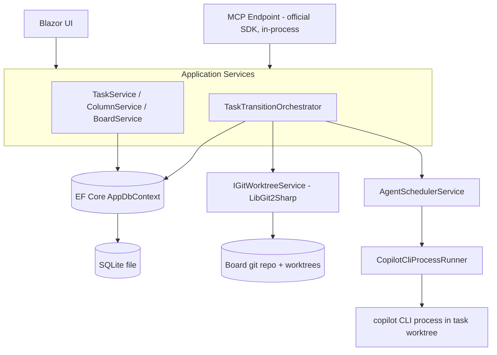

# Agent Task Harness Implementation Plan

# Requirements

Requirements are available in the [Solution Design](Solution%20Design.md) document. This implementation plan is a step-by-step guide to building the system described there.

# Technical Design

### Current State
The repository is an unmodified `Microsoft.NET.Sdk.Web` Blazor Server scaffold (`AgentTaskHarness.csproj`, target `net10.0`, `Nullable`/`ImplicitUsings` enabled), with only default template pages (`Components/Pages/Home.razor`, `Error.razor`, `NotFound.razor`) and `Program.cs` registering `AddRazorComponents().AddInteractiveServerComponents()`. There is no persistence, domain, git, agent, or MCP code yet — this is a greenfield implementation guided entirely by `AI/Solution Design.md`.

### Key Decisions (confirmed with stakeholder)
1. **Persistence: EF Core + SQLite** (code-first models + migrations) — chosen over Dapper/raw ADO.NET for easiest schema evolution (boards/columns/tasks/dependencies/agent config) and clean DI integration.
2. **Git operations: LibGit2Sharp** — a managed .NET API for branch/worktree creation, commit, and merge, avoiding manual process-argument construction for these operations.
3. **MCP implementation: official ModelContextProtocol C# SDK**, hosted **in-process** in the same ASP.NET Core app as the Blazor UI — both surfaces call the same application services (`TaskService`, `TaskTransitionOrchestrator`), guaranteeing one consistent set of business rules and avoiding multi-process SQLite contention.
4. **Agent orchestration: a dedicated `AgentSchedulerService`** owns per-board running/queued state and concurrency enforcement, so both triggers for "start next agent" (a column transition, and an agent finishing/being stopped) go through one place instead of duplicated semaphore logic.
5. **Cross-module wiring: an explicit orchestrator (`TaskTransitionOrchestrator`)**, not a pub/sub event bus. It calls `IGitWorktreeService`, `IAgentScheduler`, and task persistence directly and in a defined order (validate → commit → worktree/merge → schedule agent → persist status → notify UI). This keeps the full transition flow readable in one place while each side effect stays behind its own interface for independent testing/extension.

### Proposed Architecture
Layered, single-project structure (matches the existing single `.csproj`):
- **Domain**: plain entities/enums, no framework dependencies.
- **Application**: orchestration/business services, depend only on Domain + abstractions (`IGitWorktreeService`, `IAgentScheduler`, `IAgentProcessRunner`).
- **Infrastructure**: EF Core `AppDbContext`, LibGit2Sharp-backed git service, `copilot` CLI process runner, MCP tool handlers — implements the Application-layer abstractions.
- **Web (Components)**: Blazor pages/components for boards/columns/tasks/agent-definitions, calling Application services directly (Blazor Server already runs server-side, so no separate API layer is needed).

### Data Model
- `Board(Id, Name, RepoPath, ConcurrencyLimit)`
- `Column(Id, BoardId, Name, Order, IsBacklog, IsTerminal, AgentDefinitionId?)`
- `ColumnTransition(FromColumnId, ToColumnId)` — allowed-move edges per board.
- `TaskItem(Id, BoardId, ColumnId, Title, Description, Status, BranchName?, WorktreePath?, CreatedAt)`
- `TaskDependency(TaskId, DependsOnTaskId)`
- `AgentDefinition(Id, Name, FolderPath)` with ordered `AgentDefinitionComponent(AgentDefinitionId, ComponentId, Order)`
- `AgentComponent(Id, Name, ConfigContent)`
- `AgentRun(Id, TaskId, ColumnId, ProcessId?, Status, SessionLink?, StartedAt, EndedAt?)` — `Status` covers Queued/Working/WaitingForInput/Completed/Failed/Blocked/Stopped.

### Components
- `TaskTransitionOrchestrator` (Application) — the single place implementing the move state machine: allowed-transition check, dependency gating, worktree create/reuse, auto-commit, merge-on-Done, scheduler hand-off, status/UI update.
- `IGitWorktreeService` / `LibGit2WorktreeService` (Infrastructure) — branch+worktree create/reuse/pause/discard, commit, merge with conflict detection, resume-merge, discard-uncommitted-changes.
- `IAgentScheduler` / `AgentSchedulerService` (Application/Infrastructure) — per-board queue + running set, `RequestStart(task, column)`, `OnAgentFinished(taskId)` re-checks the queue.
- `IAgentProcessRunner` / `CopilotCliProcessRunner` (Infrastructure) — launches `copilot` CLI in the task's worktree path, generates a per-OS "git guard" shim on `PATH` that allow-lists only read-only git subcommands (`diff`, `log`, `status`, etc.) for that process, exposes kill and live-session-link.
- `AgentDefinitionService` + `AgentDefinitionFolderWriter` (Application/Infrastructure) — component add/remove/reorder, on-save folder generation.
- MCP tool handlers (Infrastructure, official SDK) — thin adapters over `TaskService`/`ColumnService`/`TaskTransitionOrchestrator` for: get task, move task, get allowed moves, report outcome.
- Blazor components: `BoardBoard.razor` (kanban grid), `ColumnConfig.razor`, `TaskCard.razor`/`TaskDetail.razor`, `AgentDefinitionEditor.razor`, `StatusIcon.razor`.

### File Structure
```
AgentTaskHarness/
  Domain/
    Entities/ (Board.cs, Column.cs, TaskItem.cs, TaskDependency.cs, AgentDefinition.cs, AgentComponent.cs, AgentRun.cs)
    Enums/ (TaskStatus.cs, AgentRunStatus.cs)
  Application/
    Boards/BoardService.cs, Columns/ColumnService.cs
    Tasks/TaskService.cs, TaskDependencyService.cs, TaskTransitionOrchestrator.cs
    Agents/AgentDefinitionService.cs, IAgentScheduler.cs, AgentSchedulerService.cs
    Abstractions/IGitWorktreeService.cs, IAgentProcessRunner.cs
  Infrastructure/
    Persistence/AppDbContext.cs, Migrations/
    Git/LibGit2WorktreeService.cs, GitGuardShimWriter.cs
    Agents/CopilotCliProcessRunner.cs, AgentDefinitionFolderWriter.cs
    Mcp/TaskMcpTools.cs
  Components/
    Pages/Boards/... Pages/Agents/...
    Shared/StatusIcon.razor, TaskCard.razor
  Program.cs (DI registration, DbContext, MapMcp, migrations-on-startup)
```

### Architecture Diagram


### Risks
- **Git guard shim**: restricting the agent's `git` to read-only subcommands must work identically on Windows/Linux/macOS; mitigated by generating a small per-OS wrapper (batch/shell) placed on a prepended `PATH` for the CLI child process only.
- **Merge conflicts**: the resume-merge flow must safely re-enter a repo left in a conflicted state after external manual resolution — `LibGit2WorktreeService` needs an explicit "conflict pending" persisted state so a resume action knows what to retry.
- **Process lifetime tracking**: the harness must reliably detect `copilot` CLI exit/crash (not just explicit stop) to release scheduler slots and update status — handled via process `Exited` event + working-directory/PID persistence for recovery after an app restart.

# Delivery Steps

### Step 1: Domain model and EF Core persistence foundation
The app has a working SQLite-backed data layer with CRUD services for boards, columns, tasks, dependencies, and agent definitions, exercised by unit tests (no UI yet).
- Add EF Core + SQLite provider packages to `AgentTaskHarness.csproj`.
- Create `Domain/Entities` for `Board`, `Column`, `TaskItem`, `TaskDependency`, `AgentDefinition`, `AgentComponent`, `AgentRun`, plus `TaskStatus`/`AgentRunStatus` enums.
- Create `Infrastructure/Persistence/AppDbContext.cs` with fluent configuration (board isolation via `BoardId` FKs, cascade rules) and an initial EF Core migration.
- Implement `Application` CRUD services: `BoardService`, `ColumnService` (including allowed-transition edges, backlog/terminal column flags), `TaskService` (task creation restricted to backlog column), `TaskDependencyService` (same-board-only dependency validation).
- Register `AppDbContext` and services in `Program.cs`; apply migrations on startup.

### Step 2: Kanban board UI and column-transition state machine
Users can manage boards/columns/tasks and move tasks through the board via the web UI, with all business rules enforced except git/agent side effects.
- Build Blazor pages: board list/detail, column configuration (create/reorder/allowed-transitions), and full task CRUD.
- Implement `TaskTransitionOrchestrator.MoveTask(taskId, targetColumnId)` enforcing: allowed-transition check, dependency-complete gating to leave backlog, dependency-list lock once started, delete-guard for tasks with a running agent.
- Wire `IGitWorktreeService` and `IAgentScheduler` as no-op stub implementations for this stage so the orchestrator's control flow and validations are fully testable before real side effects exist.
- Add UI feedback for disallowed moves (e.g., unmet dependencies, active agent).

### Step 3: Git worktree and merge lifecycle
Column transitions now drive real per-task branches/worktrees, auto-commits, and Done-column merges, with conflict recovery and pause/resume/discard controls.
- Implement `Infrastructure/Git/LibGit2WorktreeService` (`IGitWorktreeService`): create branch+worktree named after the task id on first backlog exit, auto-commit pending changes on every transition, merge-to-main and delete worktree on reaching Done.
- Add conflict detection: persist a "merge conflict pending" state on the task and expose a "resume merge" action that re-attempts the merge after manual external resolution.
- Implement backlog-return flow: prompt to discard or pause the worktree; resuming a paused task reuses the same branch/worktree instead of creating a new one.
- Add a "discard uncommitted changes" UI action wired to the git service.
- Replace the stub `IGitWorktreeService` from the previous stage with this real implementation in DI.

### Step 4: Agent definition composition
Users can compose an agent from reusable components in the UI, and saving generates the on-disk definition folder used at execution time.
- Build `AgentDefinitionService` supporting add/remove/reorder of `AgentComponent` references within an `AgentDefinition`.
- Implement `Infrastructure/Agents/AgentDefinitionFolderWriter` that serializes the composed, ordered component configuration into a definition folder on disk when saved.
- Build the `AgentDefinitionEditor.razor` UI (component picker, ordering, save) and column configuration UI for assigning an agent definition to a non-backlog, non-terminal column.

### Step 5: Agent execution environment and scheduler
Entering a column with an assigned agent launches the `copilot` CLI in the task's worktree under per-board concurrency limits, with full status visibility and manual controls.
- Implement `Infrastructure/Agents/CopilotCliProcessRunner` (`IAgentProcessRunner`): launches `copilot` CLI with the worktree folder path, generates a per-OS read-only git guard shim on the child process `PATH`, exposes live session link and kill.
- Implement `AgentSchedulerService` (`IAgentScheduler`): tracks running/queued agents per board against `Board.ConcurrencyLimit`, exposes `RequestStart` and an on-process-exit hook that auto-starts the next queued task.
- Wire `TaskTransitionOrchestrator` to call `AgentScheduler.RequestStart` after a successful column entry, and to set the task's status to "blocked: previous agent still active" instead of starting a new agent when the outgoing agent is still running.
- Add UI: status icon (working/waiting/completed/failed/blocked), clickable live session link, manual stop button, manual retry-after-failure action.

### Step 6: MCP server for agent access
Agents can interact with boards over MCP using the same business rules as the web UI, running in-process with the Blazor app.
- Add the official ModelContextProtocol C# SDK and map its endpoint in `Program.cs` alongside `MapRazorComponents`.
- Implement `Infrastructure/Mcp/TaskMcpTools` exposing: read task details, query allowed moves for a task, move a task (delegating to `TaskTransitionOrchestrator.MoveTask`), and report a task outcome as failed/succeeded (updating `AgentRun`/`TaskItem` status).
- Ensure MCP-driven moves apply the "changed column while agent still running" blocked-flag behavior (as opposed to the UI's hard block on such moves), matching the documented UI-vs-MCP asymmetry.
