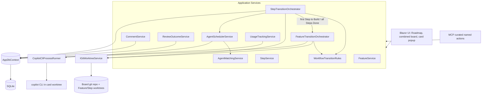

# Agent Task Harness Implementation Plan

# Requirements

Requirements are available in the [Solution Design](Solution%20Design.md) document. This implementation plan is a step-by-step guide to building the system described there.

# Technical Design

### Current State
Delivery Steps 1–4 below are ✅ **Completed** — they shipped EF Core+SQLite persistence for the original generic `Board`/`Column`/`TaskItem` model (+ CRUD services), the Kanban UI with a generic column-transition orchestrator, a single-level LibGit2Sharp worktree/merge lifecycle, and agent-definition composition with an on-save folder writer. `Solution Design.md` has since been substantially expanded (Roadmap → Board → Feature → Step hierarchy, a fixed non-configurable six-column workflow, Feature/Step dependency scoping, review-outcome counters/thresholds, comments, agent matching criteria, a Step-only scheduler with prioritization, curated MCP named actions, cost/quality tracking, and a combined drag-and-drop UI). The original Steps 5–6 (generic agent scheduler + generic MCP move/get-allowed-moves) were never implemented; Delivery Steps 5–14 below replace them wholesale and carry the system the rest of the way to the current Solution Design. The configurable `Column` entity and flat `TaskItem`/`TaskDependency` built in Steps 1–2 are retired as part of Step 5 (see the superseded-by notes on those steps).

### Key Decisions (confirmed with stakeholder)
1. **Persistence: EF Core + SQLite** (code-first models + migrations) — chosen over Dapper/raw ADO.NET for easiest schema evolution and clean DI integration; unchanged by the hierarchy redesign.
2. **Git operations: LibGit2Sharp** — a managed .NET API for branch/worktree creation, commit, and merge; reworked in Step 9 for two-level branching (Feature off `main`, Step off its Feature's branch) but the library choice is unchanged.
3. **MCP implementation: official ModelContextProtocol C# SDK**, hosted **in-process** in the same ASP.NET Core app as the Blazor UI — both surfaces call the same application services, guaranteeing one consistent set of business rules and avoiding multi-process SQLite contention.
4. **Cross-module wiring: explicit orchestrators, not a pub/sub event bus.** Retained principle from the original design; now split into `FeatureTransitionOrchestrator`/`StepTransitionOrchestrator`, each calling `IGitWorktreeService`, `IAgentScheduler` (Step only), and persistence directly and in a defined order, while both are composed around a shared `WorkflowTransitionRules` service (see decision 5) rather than inheriting from a common base.
5. **Feature/Step modeling — composition over inheritance.** `Feature` and `Step` are separate entities/tables (no shared base class or interface hierarchy). Shared concerns are expressed as reusable, composed pieces: a `WorkflowColumn` enum property on each, a shared `Comment` table keyed by `(CardType, CardId)`, and the stateless `WorkflowTransitionRules` service that both orchestrators call into (composed via DI).
6. **Fixed workflow — hardcoded enum, not a table.** The configurable `Column` entity from Step 1 is retired entirely; `Feature`/`Step` get a `WorkflowColumn` enum (`Backlog, Ready, Build, AgentReview, HumanReview, Done`). This matches "columns cannot be created/removed/reordered" exactly and removes the column-CRUD UI built in Step 2.
7. **Agent assignment moves from Column FK to column-scope + criteria.** `AgentColumnAssignment(BoardId, ColumnScope, AgentDefinitionId, MatchCriteria)` replaces the old `Column.AgentDefinitionId`, where `ColumnScope ∈ {StepBuild, StepAgentReview, FeatureAgentReview}` — a Feature's Build column can never be assigned.
8. **Scheduler only ever starts Steps.** `AgentSchedulerService` (superseding the original dedicated-scheduler decision) picks and starts eligible Steps (Ready + dependencies met) using a simple, tunable prioritization score (progress, remaining work, age); a Feature entering Build/Agent Review is always a side effect of its Steps, driven by `StepTransitionOrchestrator` calling into `FeatureTransitionOrchestrator`, never scheduler-initiated.
9. **MCP exposes curated named actions, not raw moves.** `start_build`, `submit_for_review`, `approve_review`, `fail_review`, `send_to_backlog` each map to one orchestrator call (with `fail_review` also incrementing the relevant counter); MCP-driven column changes use the soft "blocked: previous agent still active" flag, while the UI hard-blocks moving a card whose agent is running — this asymmetry is intentional.

### Proposed Architecture
Layered, single-project structure (matches the existing single `.csproj`):
- **Domain**: plain entities/enums, no framework dependencies. `Roadmap` is a computed view over a board's Features (no dedicated table).
- **Application**: `FeatureService`/`StepService`, `FeatureTransitionOrchestrator`/`StepTransitionOrchestrator` composed around shared `WorkflowTransitionRules`, `FeatureDependencyService`/`StepDependencyService`, `CommentService`, `ReviewOutcomeService`, `AgentMatchingService`, reworked `AgentSchedulerService`, `UsageTrackingService`.
- **Infrastructure**: EF Core `AppDbContext`, `LibGit2WorktreeService` reworked for two-level branching, `copilot` CLI process runner, `BoardMcpTools` (curated actions) — implements the Application-layer abstractions.
- **Web (Components)**: Roadmap view, combined Feature/Step board (top row Features, bottom row filtered Steps), card popup (details/moves/comments/counters/cost/session link), drag-and-drop (Blazor Server already runs server-side, so no separate API layer is needed).

### Data Model
- `Board(Id, Name, RepoPath, ConcurrencyLimit, SkipFeatureHumanReview, SkipStepHumanReview, AgentReviewFailThreshold, HumanReviewFailThreshold)`
- `Feature(Id, BoardId, Title, Requirements, AcceptanceCriteria, SuggestedSolution, WorkflowColumn, AlwaysRequireHumanReview, AgentReviewFailCount, HumanReviewFailCount, BranchName?, WorktreePath?)`
- `Step(Id, FeatureId, Title, Description, GuidanceNotes, WorkflowColumn, AlwaysRequireHumanReview, AgentReviewFailCount, HumanReviewFailCount, BranchName?, WorktreePath?, TokensUsed, TimeSpent)`
- `FeatureDependency(FeatureId, DependsOnFeatureId)` / `StepDependency(StepId, DependsOnStepId)`
- `Comment(Id, CardType, CardId, Author, Body, CreatedAt)`
- `AgentColumnAssignment(BoardId, ColumnScope, AgentDefinitionId, MatchCriteria)` (replaces `Column.AgentDefinitionId`)
- `AgentDefinition(Id, Name, FolderPath)` with ordered `AgentDefinitionComponent(AgentDefinitionId, ComponentId, Order)`
- `AgentComponent(Id, Name, ConfigContent)`
- `AgentRun(Id, CardType, CardId, ProcessId?, Status, SessionLink?, StartedAt, EndedAt?, TokensUsed, TimeSpent)` (replaces `TaskId`/`ColumnId`) — `Status` covers Queued/Working/WaitingForInput/Completed/Failed/Blocked/Stopped.
- **Retired**: `Column`, `TaskItem`, `TaskDependency` (from Step 1) — superseded by the above.

### Components
- `FeatureTransitionOrchestrator` / `StepTransitionOrchestrator` (Application) — composed around shared `WorkflowTransitionRules`; implement the move state machine per level: allowed-transition check, dependency gating, worktree create/reuse, auto-commit, merge-on-Done, scheduler hand-off (Step only), review-counter increment, skip-human-review auto-advance.
- `WorkflowTransitionRules` (Application) — stateless rules engine shared by both orchestrators (composition over inheritance).
- `FeatureDependencyService` / `StepDependencyService` (Application) — dependency validation/gating, same-board-only (Feature) and same-feature/cross-feature (Step) rules.
- `CommentService` (Application) — CRUD over the shared `Comment` table keyed by `(CardType, CardId)`.
- `ReviewOutcomeService` (Application) — increments `AgentReviewFailCount`/`HumanReviewFailCount`, compares against board thresholds, raises rework/issue indicators.
- `AgentMatchingService` (Application) — resolves an `AgentColumnAssignment` + `MatchCriteria` to a concrete `AgentDefinition` for a given card/column-scope.
- `IAgentScheduler` / `AgentSchedulerService` (Application/Infrastructure, reworked) — Step-only `RequestStart`, prioritization scoring (progress, remaining work, age), per-board concurrency queueing, failure-threshold skip, `OnAgentFinished(stepId)` re-checks the queue.
- `UsageTrackingService` (Application) — aggregates `AgentRun.TokensUsed`/`TimeSpent` into `GetFeatureSummary`.
- `IGitWorktreeService` / `LibGit2WorktreeService` (Infrastructure, reworked) — two-level branch/worktree create/reuse/pause/discard (Feature off `main`, Step off its Feature branch), commit, merge with conflict detection at both levels, resume-merge, discard-uncommitted-changes.
- `IAgentProcessRunner` / `CopilotCliProcessRunner` (Infrastructure) — launches `copilot` CLI in the card's worktree path, generates a per-OS "git guard" shim on `PATH` that allow-lists only read-only git subcommands (`diff`, `log`, `status`, etc.) for that process, exposes kill and live-session-link.
- `AgentDefinitionService` + `AgentDefinitionFolderWriter` (Application/Infrastructure) — component add/remove/reorder, on-save folder generation.
- `BoardMcpTools` (Infrastructure, official SDK) — curated named actions (`start_build`, `submit_for_review`, `approve_review`, `fail_review`, `send_to_backlog`) plus `get_card_details`/`get_available_actions`/comment read-write, replacing the old generic MCP tool handlers.
- Blazor components: Roadmap view, combined `Board.razor` (Feature row + filtered Step row), `FeatureCard.razor`/`StepCard.razor`, card popup (details/moves/comments/counters/cost/session link), `AgentDefinitionEditor.razor`, `StatusIcon.razor`, drag-and-drop.

### File Structure
```
AgentTaskHarness/
  Domain/
    Entities/ (Board.cs, Feature.cs, Step.cs, FeatureDependency.cs, StepDependency.cs, Comment.cs, AgentColumnAssignment.cs, AgentDefinition.cs, AgentComponent.cs, AgentRun.cs)
    Enums/ (WorkflowColumn.cs, ColumnScope.cs, CardType.cs, AgentRunStatus.cs)
  Application/
    Boards/BoardService.cs
    Features/FeatureService.cs, FeatureDependencyService.cs, FeatureTransitionOrchestrator.cs
    Steps/StepService.cs, StepDependencyService.cs, StepTransitionOrchestrator.cs
    Workflow/WorkflowTransitionRules.cs
    Comments/CommentService.cs
    Reviews/ReviewOutcomeService.cs
    Agents/AgentDefinitionService.cs, AgentMatchingService.cs, IAgentScheduler.cs, AgentSchedulerService.cs
    Usage/UsageTrackingService.cs
    Abstractions/IGitWorktreeService.cs, IAgentProcessRunner.cs
  Infrastructure/
    Persistence/AppDbContext.cs, Migrations/
    Git/LibGit2WorktreeService.cs, GitGuardShimWriter.cs
    Agents/CopilotCliProcessRunner.cs, AgentDefinitionFolderWriter.cs
    Mcp/BoardMcpTools.cs
  Components/
    Pages/Roadmap/... Pages/Boards/... Pages/Agents/...
    Shared/StatusIcon.razor, FeatureCard.razor, StepCard.razor, CardPopup.razor
  Program.cs (DI registration, DbContext, MapMcp, migrations-on-startup)
```

### Architecture Diagram


### Risks
- **Two-level git branching**: Step→Feature and Feature→main merges both need independent "conflict pending" state and resume-merge handling; mitigated by extending the conflict-pending design already built in Step 3 to both levels explicitly.
- **Prioritization algorithm scope creep**: the Solution Design explicitly leaves exact weighting open; mitigated by shipping a small, clearly-tunable scoring function rather than trying to finalize weights now.
- **UI-vs-MCP move asymmetry**: easy to accidentally apply the same hard-block rule to both surfaces; mitigated by keeping the block-vs-flag decision in one place (`AgentSchedulerService`/orchestrators) rather than duplicating it per caller.
- **Document consistency**: renaming `TaskItem`→`Feature`/`Step` and `Column`→`WorkflowColumn` touches many cross-references in the plan and codebase; mitigated by a final proofreading pass across both the Technical Design and Delivery Steps sections (Step 14).
- ~~Git guard shim~~ / ~~process lifetime tracking~~: resolved in Steps 4–5; the per-OS shim and process-exit tracking are unaffected by the hierarchy redesign.

# Delivery Steps

### ✅ Step 1: Domain model and EF Core persistence foundation — Completed
The app has a working SQLite-backed data layer with CRUD services for boards, columns, tasks, dependencies, and agent definitions, exercised by unit tests (no UI yet).
- Add EF Core + SQLite provider packages to `AgentTaskHarness.csproj`.
- Create `Domain/Entities` for `Board`, `Column`, `TaskItem`, `TaskDependency`, `AgentDefinition`, `AgentComponent`, `AgentRun`, plus `TaskStatus`/`AgentRunStatus` enums.
- Create `Infrastructure/Persistence/AppDbContext.cs` with fluent configuration (board isolation via `BoardId` FKs, cascade rules) and an initial EF Core migration.
- Implement `Application` CRUD services: `BoardService`, `ColumnService` (including allowed-transition edges, backlog/terminal column flags), `TaskService` (task creation restricted to backlog column), `TaskDependencyService` (same-board-only dependency validation).
- Register `AppDbContext` and services in `Program.cs`; apply migrations on startup.

> **Superseded by Step 5**: the configurable `Column` entity and flat `TaskItem`/`TaskDependency` built here are retired in Step 5, replaced by the fixed `WorkflowColumn` enum on the new `Feature`/`Step` entities.

### ✅ Step 2: Kanban board UI and column-transition state machine — Completed
Users can manage boards/columns/tasks and move tasks through the board via the web UI, with all business rules enforced except git/agent side effects.
- Build Blazor pages: board list/detail, column configuration (create/reorder/allowed-transitions), and full task CRUD.
- Implement `TaskTransitionOrchestrator.MoveTask(taskId, targetColumnId)` enforcing: allowed-transition check, dependency-complete gating to leave backlog, dependency-list lock once started, delete-guard for tasks with a running agent.
- Wire `IGitWorktreeService` and `IAgentScheduler` as no-op stub implementations for this stage so the orchestrator's control flow and validations are fully testable before real side effects exist.
- Add UI feedback for disallowed moves (e.g., unmet dependencies, active agent).

> **Superseded by Steps 5–7**: the column-configuration UI (create/reorder/allowed-transitions) built here is removed since columns are now a fixed, non-configurable enum; `TaskTransitionOrchestrator` is superseded by the composed `FeatureTransitionOrchestrator`/`StepTransitionOrchestrator` (Step 6).

### ✅ Step 3: Git worktree and merge lifecycle — Completed
Column transitions now drive real per-task branches/worktrees, auto-commits, and Done-column merges, with conflict recovery and pause/resume/discard controls.
- Implement `Infrastructure/Git/LibGit2WorktreeService` (`IGitWorktreeService`): create branch+worktree named after the task id on first backlog exit, auto-commit pending changes on every transition, merge-to-main and delete worktree on reaching Done.
- Add conflict detection: persist a "merge conflict pending" state on the task and expose a "resume merge" action that re-attempts the merge after manual external resolution.
- Implement backlog-return flow: prompt to discard or pause the worktree; resuming a paused task reuses the same branch/worktree instead of creating a new one.
- Add a "discard uncommitted changes" UI action wired to the git service.
- Replace the stub `IGitWorktreeService` from the previous stage with this real implementation in DI.

### ✅ Step 4: Agent definition composition — Completed
Users can compose an agent from reusable components in the UI, and saving generates the on-disk definition folder used at execution time.
- Build `AgentDefinitionService` supporting add/remove/reorder of `AgentComponent` references within an `AgentDefinition`.
- Implement `Infrastructure/Agents/AgentDefinitionFolderWriter` that serializes the composed, ordered component configuration into a definition folder on disk when saved.
- Build the `AgentDefinitionEditor.razor` UI (component picker, ordering, save) and column configuration UI for assigning an agent definition to a non-backlog, non-terminal column.

> **Steps 5–14 replace the original Steps 5–6** (never implemented) with the more granular sequence below, covering the rest of `Solution Design.md`.

### ✅ Step 5: Hierarchical domain and persistence rework — Completed
The database schema matches the Roadmap/Feature/Step hierarchy, with the old generic model retired.
- Retire `Column`, `TaskItem`, `TaskDependency` entities, DbSets, and their EF Core configuration.
- Add `Domain/Entities`: `Feature`, `Step`, `FeatureDependency`, `StepDependency`, `Comment`, plus `WorkflowColumn` and `CardType` enums.
- Add `Board.SkipFeatureHumanReview`, `Board.SkipStepHumanReview`, `Board.AgentReviewFailThreshold`, `Board.HumanReviewFailThreshold`.
- Update `AppDbContext` fluent configuration (FKs, cascade rules for `Feature`→`Step`, `Comment` keyed by `(CardType, CardId)`) and add a new EF Core migration.
- Implement `Application` CRUD services: `FeatureService`, `StepService`.

### ✅ Step 6: Shared workflow transition rules and dependency gating — Completed
A shared rules engine and dependency services back both Feature and Step transitions, ready to be driven by orchestrators in the next step.
- Implement `Application/Workflow/WorkflowTransitionRules`: a stateless service encoding the fixed `WorkflowColumn` sequence and which moves are legal.
- Implement `FeatureDependencyService`/`StepDependencyService`: same-board (Feature) and same-feature/cross-feature (Step) dependency validation and "all dependencies Done" gating.
- Implement `FeatureTransitionOrchestrator`/`StepTransitionOrchestrator` composed around `WorkflowTransitionRules` and the dependency services, exposing a `MoveAsync(cardId, targetColumn)` that enforces allowed-transition + dependency gating (git/scheduler/review side effects land in later steps).
- Unit-test the rules engine and both orchestrators' gating logic in isolation.

### ✅ Step 7: Automatic Feature lifecycle and skip-human-review behavior — Completed
Feature cards automatically track their Steps' progress, and boards/cards can skip human review per the configured toggles.
- Wire `StepTransitionOrchestrator` to call into `FeatureTransitionOrchestrator` on two triggers: first Step entering Build (Feature Ready→Build) and all Steps reaching Done (Feature Build→AgentReview).
- Implement skip-human-review auto-advance: when `Board.SkipFeatureHumanReview`/`SkipStepHumanReview` is set and the card's `AlwaysRequireHumanReview` override is false, `AgentReview`→`Done` happens automatically instead of stopping at `HumanReview`.
- Add UI controls for the per-board toggles and the per-card `AlwaysRequireHumanReview` override.

### Step 8: Comments and review-outcome counters
Cards carry a comment thread and review-outcome counters that drive derived rework/issue indicators.
- Implement `CommentService`: add/list comments for a `(CardType, CardId)`, ordered by `CreatedAt`.
- Implement `ReviewOutcomeService`: increments `AgentReviewFailCount`/`HumanReviewFailCount` on a failed review, compares against the board's thresholds, and exposes a derived "rework"/"issue" indicator once a threshold is crossed.
- Wire `FeatureTransitionOrchestrator`/`StepTransitionOrchestrator` to call `ReviewOutcomeService` whenever a card is sent back from a review column.
- Add a comments panel and counter/indicator display to the card UI (basic list view is enough here; full popup styling lands in Step 14).

### Step 9: Two-level git worktree and merge lifecycle
Feature and Step transitions now drive real two-level branches/worktrees, auto-commits, and Done-column merges at both levels, with conflict recovery and pause/resume/discard controls.
- Rework `Infrastructure/Git/LibGit2WorktreeService` (`IGitWorktreeService`) for two-level branching: a Feature branch created off `main` on its first Step entering Build, and each Step branch created off its Feature's branch on first Build entry.
- Implement merge-on-Done at both levels: a Step merges into its Feature branch on Step Done; a Feature merges into `main` and deletes both worktrees on Feature Done.
- Extend the existing "conflict pending" persisted state and resume-merge action to track conflicts independently per level (Step→Feature vs Feature→main).
- Implement backlog-return flow (discard or pause the worktree) and a "discard uncommitted changes" UI action for both Feature and Step cards.
- Replace the single-level `IGitWorktreeService` implementation from Step 3 with this reworked one in DI.

### Step 10: Agent matching criteria and column-scope assignment
Boards assign agent definitions to eligible column-scopes with matching criteria instead of a single per-column FK.
- Add `Domain/Entities/AgentColumnAssignment(BoardId, ColumnScope, AgentDefinitionId, MatchCriteria)` and the `ColumnScope` enum (`StepBuild, StepAgentReview, FeatureAgentReview`); retire `Column.AgentDefinitionId`.
- Implement `AgentMatchingService`: given a card and its column-scope, evaluates `MatchCriteria` across the board's `AgentColumnAssignment`s and resolves the concrete `AgentDefinition` to run.
- Update `AgentDefinitionEditor.razor`'s column-configuration UI to assign definitions + criteria per column-scope, restricted to the three eligible scopes (Feature Build is never assignable).

### Step 11: Step-only agent scheduler rework
The scheduler starts only Steps, using a tunable prioritization score, and distinguishes the soft blocked-flag from the UI's hard block.
- Rework `AgentSchedulerService` (`IAgentScheduler`) to accept only Step start requests; a Feature never triggers `RequestStart` directly (that stays a side effect of its Steps per Step 7).
- Implement a prioritization score (progress, remaining work, age) used to order the per-board queue when the `Board.ConcurrencyLimit` is reached; document the weighting as a tunable constant, explicitly left open per the Solution Design.
- Implement the failure-threshold skip: a Step whose counters have crossed the board's fail threshold is left queued/flagged rather than auto-started.
- Wire `StepTransitionOrchestrator` to call `AgentScheduler.RequestStart` after a successful Build/AgentReview column entry, setting the soft "blocked: previous agent still active" status for MCP-driven moves while the UI keeps hard-blocking such moves (asymmetry from Key Decision 9).

### Step 12: MCP curated named actions
Agents interact with boards over MCP using curated named actions instead of raw column moves, running in-process with the Blazor app.
- Add the official ModelContextProtocol C# SDK and map its endpoint in `Program.cs` alongside `MapRazorComponents` (superseding the plan for a generic `TaskMcpTools`).
- Implement `Infrastructure/Mcp/BoardMcpTools` exposing named actions `start_build`, `submit_for_review`, `approve_review`, `fail_review`, `send_to_backlog`, each delegating to one `FeatureTransitionOrchestrator`/`StepTransitionOrchestrator` call; `fail_review` also calls `ReviewOutcomeService` to increment the relevant counter.
- Add `get_card_details`, `get_available_actions`, and comment read/write (`CommentService`) tools.
- Ensure MCP-driven actions apply the soft "blocked: previous agent still active" flag rather than the UI's hard block, per the documented asymmetry (Step 11).

### Step 13: Cost and usage tracking
Token/time usage is captured per agent run and rolled up to the Feature level for display.
- Add `TokensUsed`/`TimeSpent` capture to `AgentRun` at process completion (`CopilotCliProcessRunner`/`AgentSchedulerService`) and to `Step.TokensUsed`/`Step.TimeSpent`.
- Implement `UsageTrackingService.GetFeatureSummary(featureId)` aggregating token/time totals across a Feature's Steps.
- Add a minimal cost display to the card UI (basic totals are enough here; full popup styling lands in Step 14).
- Document quality-signal metrics (beyond cost) as an open extension point, per the Solution Design's explicit deferral.

### Step 14: Combined board UI, card popup, and final proofread
The full Roadmap/Board/Feature/Step experience is available end-to-end through a combined drag-and-drop UI, and the document is internally consistent.
- Build the Roadmap view (computed list of a board's Features) and the combined `Board.razor` (Feature row on top, filtered Step row underneath for the selected/expanded Feature).
- Build the card popup: details, available moves, comments (Step 8), review counters/indicators (Step 8), cost summary (Step 13), live session link, and manual controls (stop/retry/discard).
- Implement drag-and-drop for both Feature and Step cards, with the UI hard-block on dragging a card whose agent is currently running (Step 11).
- Add status/rework/issue indicators to the card visuals, driven by `ReviewOutcomeService`'s derived state (Step 8).
- Proofread the full document for consistent entity/service naming between the Technical Design and Delivery Steps sections.
