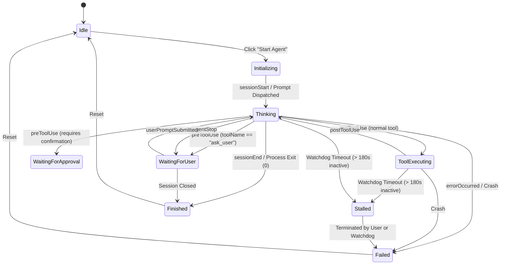

# Design Document: Interactive Copilot Agent Test Harness

## 1. Overview & Objective

The goal of this feature is to provide an interactive test playground within **AgentTaskHarness** where users can launch, monitor, and interact with a GitHub Copilot CLI agent directly in the browser. 

Key capabilities:
- **Embedded Web Terminal**: Full interactive terminal experience (`xterm.js`) supporting prompt responses, file additions (`@file` syntax), interactive approvals, ANSI colors, and cursor navigation.
- **Pure .NET & Web Tech Stack**: Eliminates external script runtimes (no Python or Node daemon required). Pseudo-terminal (PTY) allocation and process supervision run directly within the ASP.NET Core backend via POSIX P/Invoke (`openpty` / `posix_spawn`).
- **Hook-Driven State Tracking**: Uses GitHub Copilot CLI lifecycle hooks (`preToolUse`, `postToolUse`, `agentStop`, `sessionStart`, etc.) to stream precise execution states to the UI without unreliable terminal screen scraping.
- **Dynamic Status Indicator**: Displays real-time agent status (*Initializing*, *Thinking*, *Running Tool*, *Waiting for Chat Response*, *Waiting for Prompt Approval*, *Hang / Stalled*, *Finished*, *Failed*).
- **Inactivity Watchdog**: Automatically detects hangs and timeouts while the agent is in a working state.
- **Customizable Requirements**: Accepts a user-specified project working directory and task requirements on the page, merged with a built-in default agent definition.

---

## 2. Technology Stack & "No Python" Architecture

### Why Python is Not Needed
While Python's `pty.fork()` is commonly used for quick prototypes, it introduces an unnecessary external dependency, environment coupling, and process management complexity. 

Instead, the entire feature can be built natively using **.NET 10 and Web Technologies**:

```
+-----------------------------------------------------------------------------------+
| Browser (Web Tech)                                                                |
| - Blazor Interactive Server Component (/test-agent)                               |
| - xterm.js + @xterm/addon-fit (via ESM / CDN or bundled static assets)            |
| - SignalR JS Client (bidirectional stdin/stdout streaming & resize events)        |
+------------------------------------------^----------------------------------------+
                                           | WebSocket / SignalR Hub
+------------------------------------------v----------------------------------------+
| ASP.NET Core Backend (.NET 10)                                                    |
| - TerminalHub: SignalR Hub piping streams to/from child process                   |
| - AgentHookController: Receives JSON webhook callbacks from Copilot CLI hooks     |
| - NativePtySession: Wraps POSIX master PTY file descriptor in .NET FileStream    |
| - PosixPtyLauncher: P/Invokes openpty + posix_spawn on macOS/Linux               |
| - AgentWatchdogTimer: Monitors elapsed time & output heartbeats for hang detection|
+------------------------------------------^----------------------------------------+
                                           | Master PTY FD (SafeFileHandle / FileStream)
+------------------------------------------v----------------------------------------+
| Child Process Subsystem (macOS)                                                   |
| - Slave PTY FD (attached to stdin, stdout, stderr)                                |
| - Process: /opt/homebrew/bin/copilot -i "<prompt>" -C "<targetDir>"               |
| - Hooks: curl -s -X POST http://localhost:{port}/api/test-agent/hook/...          |
+-----------------------------------------------------------------------------------+
```

### Pure .NET POSIX PTY Implementation
On macOS (and Linux), POSIX provides standard pseudo-terminal primitives in `libutil` and `libc`:
1. `openpty(out int masterFd, out int slaveFd, IntPtr.Zero, IntPtr.Zero, IntPtr.Zero)` allocates a pseudo-terminal pair.
2. `posix_spawn_file_actions_init` / `adddup2` maps `slaveFd` to file descriptors `0` (stdin), `1` (stdout), and `2` (stderr).
3. `posix_spawnp` launches `copilot` inside the PTY session.
4. The server wraps `masterFd` in a `SafeFileHandle` and exposes it as standard asynchronous .NET `FileStream`.
5. Window resize messages (`TIOCSWINSZ` ioctl) are sent directly to `masterFd` when the user resizes their browser window.

---

## 3. GitHub Copilot CLI Hooks Integration

GitHub Copilot CLI natively supports **deterministic lifecycle hooks** configured via `.github/hooks/*.json` or session settings. Rather than scraping terminal text, Copilot invokes hook commands at lifecycle milestones and passes context as JSON via `stdin`.

### Supported Lifecycle Events & State Mapping

| Hook Event | Copilot CLI Occurrence | Harness State | Badge Display |
| :--- | :--- | :--- | :--- |
| `sessionStart` | CLI initializes or resumes | `Initializing` | Blue spinner |
| `userPromptSubmitted` | Keystroke submitted / turn started | `Thinking` | Amber pulse |
| `preToolUse` | Before tool executes (`bash`, `edit`, `ask_user`, etc.) | `ToolExecuting` or `WaitingForApproval` / `WaitingForUser` | Amber or Orange |
| `postToolUse` | After tool completes | `Thinking` / `NextAction` | Amber pulse |
| `agentStop` | Agent finished responding to turn | `WaitingForUser` | Purple prompt icon |
| `errorOccurred` | Uncaught CLI exception or network fault | `Failed` | Red error icon |
| `sessionEnd` | CLI process terminates | `Finished` | Green checkmark |

### Hook Configuration Generation
When a test session starts, the harness generates a temporary hooks file in `AI/.agent-temp/test-hooks-{sessionId}.json`:

```json
{
  "version": 1,
  "hooks": {
    "sessionStart": [
      { "type": "command", "bash": "curl -s -X POST http://127.0.0.1:{port}/api/test-agent/hook/{sessionId}/sessionStart -H 'Content-Type: application/json' -d @-" }
    ],
    "userPromptSubmitted": [
      { "type": "command", "bash": "curl -s -X POST http://127.0.0.1:{port}/api/test-agent/hook/{sessionId}/userPromptSubmitted -H 'Content-Type: application/json' -d @-" }
    ],
    "preToolUse": [
      { "type": "command", "bash": "curl -s -X POST http://127.0.0.1:{port}/api/test-agent/hook/{sessionId}/preToolUse -H 'Content-Type: application/json' -d @-" }
    ],
    "postToolUse": [
      { "type": "command", "bash": "curl -s -X POST http://127.0.0.1:{port}/api/test-agent/hook/{sessionId}/postToolUse -H 'Content-Type: application/json' -d @-" }
    ],
    "agentStop": [
      { "type": "command", "bash": "curl -s -X POST http://127.0.0.1:{port}/api/test-agent/hook/{sessionId}/agentStop -H 'Content-Type: application/json' -d @-" }
    ],
    "errorOccurred": [
      { "type": "command", "bash": "curl -s -X POST http://127.0.0.1:{port}/api/test-agent/hook/{sessionId}/errorOccurred -H 'Content-Type: application/json' -d @-" }
    ],
    "sessionEnd": [
      { "type": "command", "bash": "curl -s -X POST http://127.0.0.1:{port}/api/test-agent/hook/{sessionId}/sessionEnd -H 'Content-Type: application/json' -d @-" }
    ]
  }
}
```

The hooks directory is passed via `--add-dir` or placed in `.github/hooks/` within the target project directory.

---

## 4. State Machine & Hang / Timeout Detection



### Watchdog & Hang Detection Logic
- The `AgentWatchdogTimer` keeps a `LastActivityTimestamp` updated whenever:
  1. A hook event arrives.
  2. The PTY output stream emits bytes.
- When the agent is in `Thinking` or `ToolExecuting` state and no activity is detected for a configurable duration (default: 3 minutes):
  - State transitions to `Stalled / Timed Out`.
  - The UI badge displays a warning: *"Agent appears stalled (no activity for 3m)"*.
  - An "Interrupt" button appears (sends `SIGINT` / `Ctrl+C` into the PTY stream).

---

## 5. User Interface Design (`/test-agent`)

The page is built with Blazor Interactive Server and styled with Tailwind CSS:

### UI Layout
```
+-----------------------------------------------------------------------------------+
|  Copilot Agent Test Playground                                                    |
+-----------------------------------------------------------------------------------+
| Configuration                                                                     |
| Target Project Directory: [/Users/gud/RiderProjects/ExampleApp                  ] |
| Task Requirements:                                                                |
| [ Add integration tests for the authentication workflow. Ensure 100% pass.      ] |
|                                                                                   |
| Actions: [ ▶ Start Agent ]  [ ⏹ Stop Agent ]  [ ↺ Clear Terminal ]                 |
| Status:  [ 🟡 Tool Executing: bash "dotnet test" | Elapsed: 01:24 ]                |
+-----------------------------------------------------------------------------------+
| Interactive Terminal (xterm.js)                                                   |
| > copilot -i "..."                                                                |
| Copilot: Inspecting project structure...                                          |
| Approved tool call: bash "dotnet test"                                            |
| $ dotnet test                                                                     |
| ...                                                                               |
|                                                                                   |
+-----------------------------------------------------------------------------------+
```

### In-Code Default Agent Definition
```csharp
public static class DefaultTestAgentDefinition
{
    public const string Role = "Interactive Test & Verification Assistant";
    
    public const string Prompt = 
        """
        You are an autonomous engineering and testing assistant.
        Your goal is to inspect the codebase in the current working directory and fulfill the requested task requirements.
        
        Guidelines:
        1. Discover existing project structure and testing frameworks before making changes.
        2. Make minimal, focused code modifications.
        3. Run existing and new tests to verify all functionality passes cleanly.
        4. If you require clarification or user input, use the ask_user tool.
        5. Summarize your completed work clearly once all requirements are satisfied.
        """;
}
```

---

## 6. Implementation Breakdown

| File / Component | Purpose |
| :--- | :--- |
| `Infrastructure/Pty/NativePosixPty.cs` | POSIX P/Invoke bindings (`openpty`, `posix_spawn`, `ioctl TIOCSWINSZ`, `kill`). |
| `Infrastructure/Pty/PtySession.cs` | Manages PTY master `FileStream`, process lifecycle, and background reading. |
| `Infrastructure/Pty/IPtyService.cs` | Service interface to start, stop, resize, and stream PTY sessions. |
| `Application/TestAgent/TestAgentSessionManager.cs` | Coordinates session state, hook callbacks, requirements assembly, and watchdog. |
| `Components/Hubs/TerminalHub.cs` | SignalR Hub for streaming terminal input/output and window resize events. |
| `Controllers/AgentHookController.cs` | Minimal API / Controller receiving Copilot lifecycle hook POST requests. |
| `Components/Pages/TestAgentPlayground.razor` | Blazor Interactive Server page with inputs, status badge, and controls. |
| `Components/Shared/XtermTerminal.razor` | Blazor wrapper hosting `xterm.js`, handling fit addon, and SignalR connection. |
| `wwwroot/js/xterm-interop.js` | JavaScript interop initializing xterm.js and binding to `TerminalHub`. |

---

## 7. Next Steps

With this design saved, implementation will proceed in the following order:
1. Implement POSIX PTY process launcher and stream handling in pure C#.
2. Create SignalR `TerminalHub` and client-side `xterm.js` interop component.
3. Build `AgentHookController` and ephemeral hook configuration writer.
4. Implement `TestAgentPlayground.razor` page with status indicators, watchdog, and configuration inputs.
5. Verify end-to-end launching, interaction, status reporting, and stopping.
